# 2D Ising Model Monte Carlo Simulation Project

This project implements a Monte Carlo simulation of the 2D Ising Model using the Metropolis-Hastings algorithm and Gibbs sampling to study phase transition phenomena on a 100x100 lattice, both with and without an external magnetic field.

## Table of Contents

1. [Project Overview](#project-overview)
2. [Theoretical Background](#theoretical-background)
3. [Project Structure](#project-structure)
4. [Dependencies](#dependencies)
5. [Usage](#usage)
6. [Simulation Details](#simulation-details)
7. [Performance and Accuracy Improvements](#performance-and-accuracy-improvements)
8. [Results Analysis](#results-analysis)
   - [Comparison of Sampling Methods (Metropolis vs Gibbs at H=0)](#comparison-of-sampling-methods-metropolis-vs-gibbs-at-h0)
   - [External Field Effects (Gibbs Sampling with H≠0)](#external-field-effects-gibbs-sampling-with-h≠0)
9. [References](#references)

## Project Overview

The 2D Ising model is a classic model in statistical physics for studying phase transitions. This project uses the Monte Carlo method (specifically Metropolis-Hastings and Gibbs sampling) to simulate the 2D Ising model at different temperatures on a $100 \times 100$ lattice ($L=100$). It calculates key physical quantities such as Energy per site and magnetic Susceptibility, and visualizes the system\'s evolution through animations to investigate the phase transition behavior. An extension is included to study the model under an external magnetic field.

Main objectives:
1. Implement the Metropolis algorithm for the 2D Ising model on a $100 \times 100$ grid.
2. Implement an alternative Gibbs sampling approach for comparison.
3. Calculate and plot the average Energy per site $\langle E \rangle / N^2$, average Magnetization $\langle M \rangle / N^2$ (or $\langle |M| \rangle / N^2$ for H=0), and Susceptibility $\chi$ as functions of Temperature $T$.
4. Visualize typical spin configuration dynamics at different temperatures using animations.
5. Investigate the effect of a non-zero external magnetic field $H$ on the system\'s properties and phase transition using Gibbs sampling.
6. Identify the critical temperature $T_c$ from the simulation results (for $H=0$).

## Theoretical Background

The Ising model describes a lattice system composed of spins (±1), where each spin interacts with its nearest neighbors and potentially an external magnetic field $H$. The Hamiltonian of the model (with coupling constant $J=1$) is:

$$ H = - J \sum_{\langle i,j \rangle} s_i s_j - H \sum_i s_i $$

where:
*   $J$ is the coupling constant (set to $J=1$ for ferromagnetic interaction in this simulation).
*   $\langle i,j \rangle$ denotes summation over nearest-neighbor pairs.
*   $s_i$ is the spin (+1 or -1) at site $i$.
*   $H$ is the external magnetic field strength.
*   The first term represents the interaction energy between neighboring spins. Lower energy is achieved when neighbors align (for $J>0$).
*   The second term represents the interaction energy with the external field. Lower energy is achieved when spins align with the field $H$ (e.g., spins prefer +1 if $H>0$).

In the absence of an external field ($H=0$), a two-dimensional system exhibits a second-order phase transition at the critical temperature:

$$ T_c(H=0) = \frac{2J}{k_B \ln(1 + \sqrt{2})} \approx 2.269 \frac{J}{k_B} $$

(In our simulation, we set $J=1$ and $k_B=1$, so $T_c(H=0) \approx 2.269$). Below $T_c$, the system exhibits spontaneous magnetization (ferromagnetic phase), while above $T_c$, it is in a disordered state (paramagnetic phase).

When an external field $H \neq 0$ is applied, the system\'s behavior changes significantly:

1.  **Energy Landscape**: The field introduces a bias favoring spin alignment with the field, explicitly breaking the up/down symmetry present when $H=0$.
2.  **Update Probability**: Both Metropolis and Gibbs sampling probabilities are modified. For Metropolis, the energy change $\Delta E$ now includes a field term $2 H s_k$. For Gibbs, the conditional probability $P(s_i = +1 | \text{neighbors}, h)$ depends directly on $H$.
3.  **Phase Transition**: Any non-zero external field destroys the true second-order phase transition. The singularity at $T_c$ is smoothed into a crossover region.

## Project Structure

The project consists of three main Python files:

1. `ising_model.py`: Implements the simulation for the standard Ising model ($H=0$) using Metropolis-Hastings.
2. `ising_model_with_field.py`: Implements the simulation including an external magnetic field ($H \neq 0$) using Metropolis-Hastings.
3. `ising_model_gibbs.py`: Implements the simulation using Gibbs sampling ($H=0$).
4. `ising_model_gibbs_field.py`: Implements the simulation using Gibbs sampling with an external field ($H \neq 0$).

Each file contains the following logical modules:

1. **LatticeSetup**: Responsible for creating and initializing the lattice, handling periodic boundary conditions.
2. **EnergyCalculator**: Calculates total energy and energy changes during updates.
3. **Observables**: Calculates measurable quantities such as magnetization and collects measurements.
4. **MetropolisStep/GibbsSampling**: Implements the core update steps (Metropolis or Gibbs).
5. **SimulationRunner**: Controls the simulation process, including equilibration and measurement phases, and returns calculated observables (Energy, Magnetization, Susceptibility).
6. **Animation Function**: `create_ising_animation` or `create_ising_gibbs_animation` generates GIF animations of the lattice evolution.
7. **Main Block**: Sets parameters, runs the temperature scan, plots results, and generates animations.

## Dependencies

This project requires the following Python libraries:

```bash
numpy      # Numerical computation
matplotlib # Result visualization
imageio    # Saving animations (GIFs)
numba      # JIT compilation for speedup
```

You can install them using pip:

```bash
pip install numpy matplotlib imageio numba
```

## Usage

To run the simulations:

1. **Standard Ising Model ($H=0$) with Metropolis algorithm**:
    ```bash
    python ising_model.py
    ```
2. **Ising Model with External Field ($H \neq 0$) with Metropolis algorithm**:
    ```bash
    python ising_model_with_field.py
    ```
3. **Standard Ising Model ($H=0$) with Gibbs Sampling**:
    ```bash
    python ising_model_gibbs.py
    ```
4. **Ising Model with External Field ($H \neq 0$) with Gibbs Sampling**:
    ```bash
    python ising_model_gibbs_field.py
    ```

All scripts will execute the simulation using the parameters defined in their respective `__main__` blocks and save the output plots and animations to the `image/`, `image_gibbs/` or `image_field/` directory.

Current default parameters in the main blocks (may vary slightly between files):
- `param_L = 50` (resulting in a $100 \times 100$ lattice)
- Equilibration sweeps (e.g., `param_eq_sweeps = 5000` for H=0, reduced for H>0)
- Measurement sweeps (e.g., `param_meas_sweeps = 10000` for H=0, reduced for H>0)
- Temperature values constructed with dense sampling near $T_c$ (for H=0) or a broader range (for H>0)

## Simulation Details

The simulation process described below applies generally to all scripts:

1.  **Parameter Setup**: Define lattice size L, temperature range/points, field strength H (if applicable), and simulation sweeps.
2.  **Initialization**: Create the initial lattice (random or ordered based on temperature/field).
3.  **Equilibration**: Run the simulation for a number of sweeps (`param_eq_sweeps`) without taking measurements to allow the system to reach thermal equilibrium.
4.  **Measurement**: Run the simulation for `param_meas_sweeps` sweeps, periodically measuring energy and magnetization.
5.  **Averaging**: Calculate average energy per site $\langle E \rangle / N^2$, average magnetization ($\langle |M| \rangle$ for H=0, $\langle M \rangle$ for H≠0), and magnetic susceptibility $\chi$ from the measurements, often using binning to reduce correlation errors.
6.  **Temperature/Field Scan**: Repeat steps 2-5 for different temperature values or field strengths.
7.  **Plotting & Animation**: Generate plots of observables vs. temperature/field and create animations for selected parameter sets.

## Performance and Accuracy Improvements

To enhance the simulation's speed, noise reduction, and the clarity of the phase transition, the following improvements have been implemented:

1. **Numba JIT Acceleration**: Core computational functions (`_sum_neighbor_spins`, `calculate_total_energy`, `metropolis_step`, `gibbs_step_field`, etc.) are accelerated using Numba's JIT compiler (`@numba.jit`). Parallel execution (`parallel=True`) is used where appropriate.
2. **Optimized Sweep Functions**: Sweep functions (`metropolis_sweep`, `gibbs_sweep_field`) perform multiple steps within compiled code, reducing Python loop overhead.
3. **Temperature-Dependent Initialization**: Using ordered initial states at low T and random states near/above $T_c$ improves equilibration.
4. **Improved Measurement Strategy**: Measuring less frequently (e.g., every 5 sweeps) and using data binning reduces correlations and improves statistical accuracy.
5. **Refined Temperature Sampling**: Dense sampling near $T_c$ (for H=0) focuses computation where physics is most interesting.
6. **Increased Statistics**: Sufficient equilibration and measurement sweeps ensure reliable results.

## Results Analysis

### Comparison of Sampling Methods (Metropolis vs Gibbs at H=0)

We compare the standard Metropolis-Hastings algorithm (`ising_model.py`) with Gibbs sampling (`ising_model_gibbs.py`) for the H=0 case. Both methods aim to sample configurations according to the Boltzmann distribution.

**Observables vs. Temperature:**

| Method      | Plot                                                                                                         |
| :---------- | :----------------------------------------------------------------------------------------------------------- |
| Metropolis  | 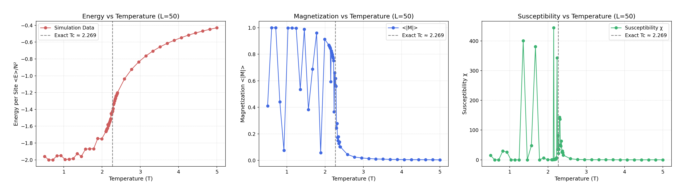                    |
| Gibbs       | 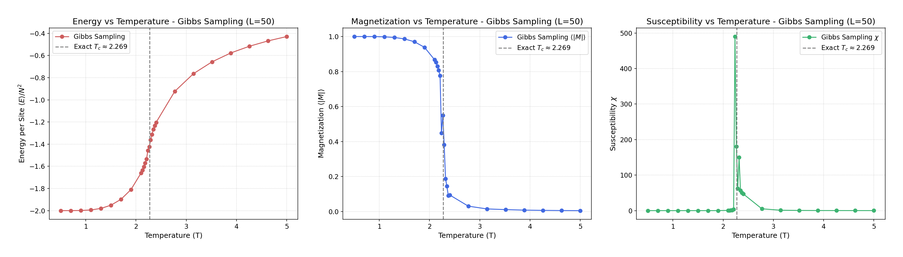                      |

**Observations:**

- **Consistency**: Both methods yield nearly identical results for average energy, magnetization, and susceptibility across the temperature range. The location and shape of the susceptibility peak (indicating $T_c \approx 2.269$) are consistent.
- **Performance**: Gibbs sampling generally runs faster for this model. This is because it directly samples the new spin state based on conditional probability without a potentially time-consuming accept/reject step like Metropolis. This efficiency is particularly noticeable when using Numba acceleration.

**Animations at Different Temperatures (H=0):**

*Near Critical Temperature (T≈2.27, β≈0.441):*

| Method      | Animation                                                                                            |
| :---------- | :--------------------------------------------------------------------------------------------------- |
| Metropolis  | 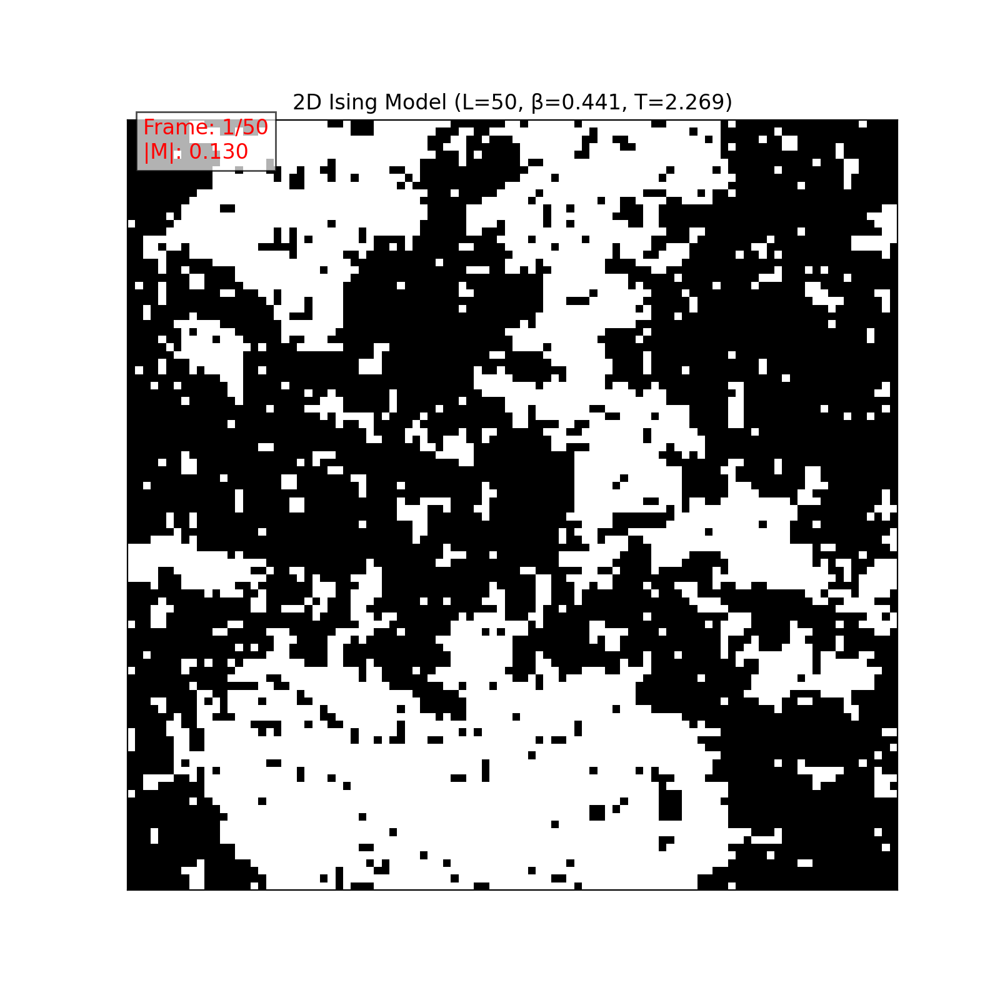                  |
| Gibbs       | 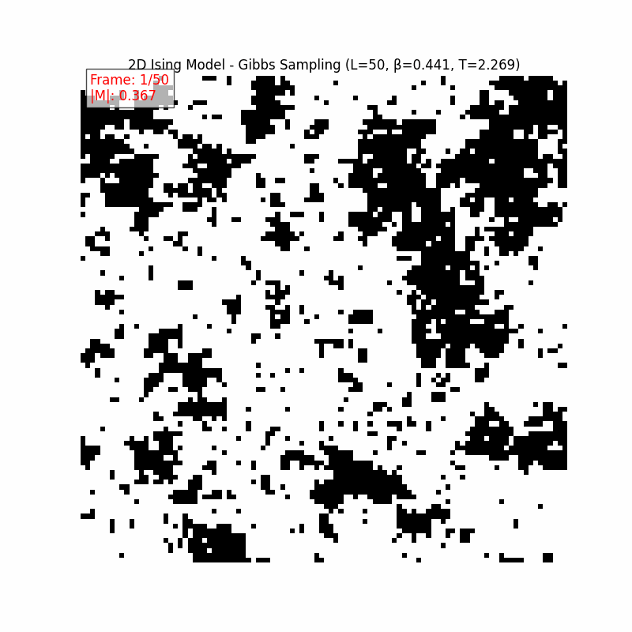                     |

*High Temperature (T=5.0, β=0.200):*

| Method      | Animation                                                                                            |
| :---------- | :--------------------------------------------------------------------------------------------------- |
| Metropolis  |                     |
| Gibbs       | 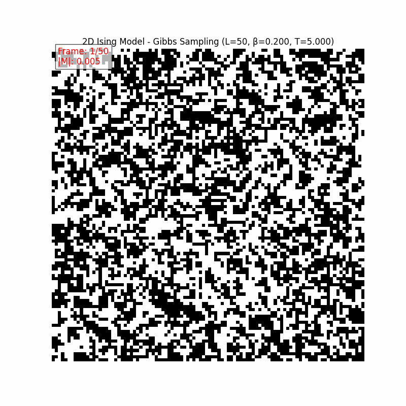                       |

*Low Temperature (T=1.0, β=1.000):*

| Method      | Animation                                                                                            |
| :---------- | :--------------------------------------------------------------------------------------------------- |
| Metropolis  | 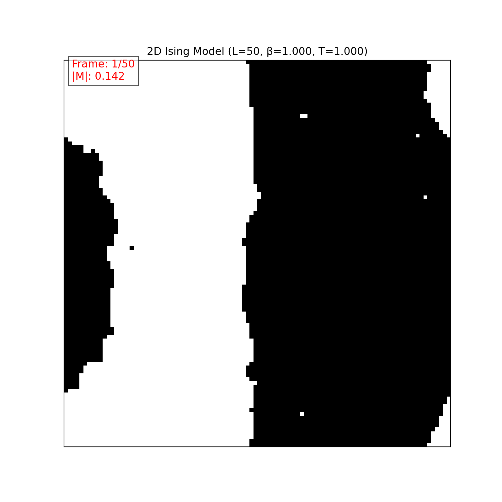                     |
| Gibbs       | 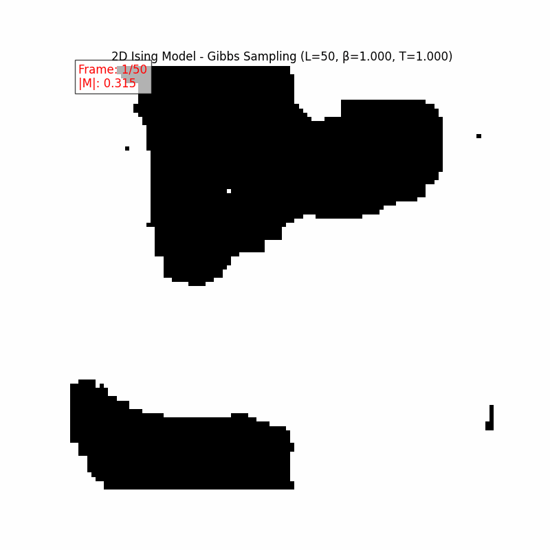                        |


- **Dynamics**: Animations confirm that both algorithms correctly capture the system dynamics:
  - At high temperatures, both show a rapidly fluctuating disordered state.
  - Near the critical point, both show characteristic large-scale fluctuations and domain formation/dissolution.
  - At low temperatures, both show the formation of large, stable domains characteristic of the ordered ferromagnetic phase.

**Conclusion**: For the 2D Ising model without an external field, both Metropolis and Gibbs sampling produce accurate and consistent results. Gibbs sampling offers a performance advantage.

### External Field Effects (Gibbs Sampling with H≠0)

We use the Gibbs sampling approach (`ising_model_gibbs_field.py`) to investigate the effects of a non-zero external magnetic field ($H$) on the system.

**Observables vs. Temperature for Different Fields:**

These plots show how energy, magnetization, and susceptibility change with temperature for various field strengths (H=0.0, 0.1, 0.3, 0.5, 1.0), using Gibbs sampling.

*H=0.0:*


*H=0.1:*
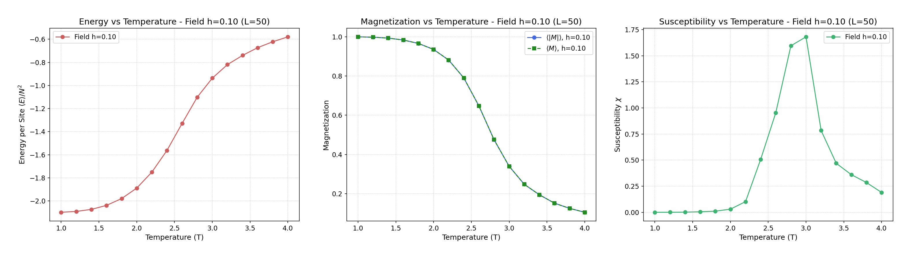

*H=0.3:*
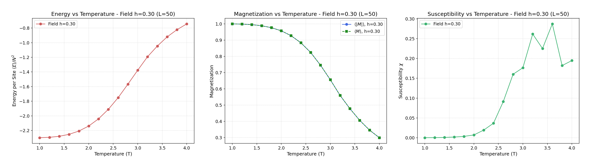

*H=0.5:*
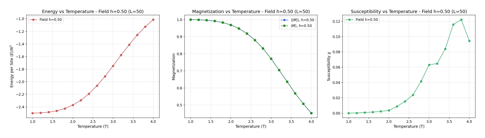

*H=1.0:*
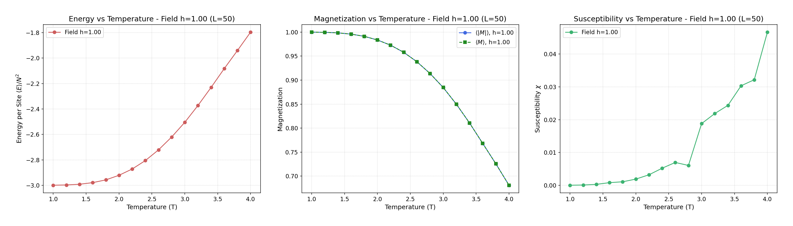

**Magnetization vs. External Field (M-H Curves):**

This plot shows how the average magnetization $\langle M \rangle$ responds to the external field $H$ at different fixed temperatures.

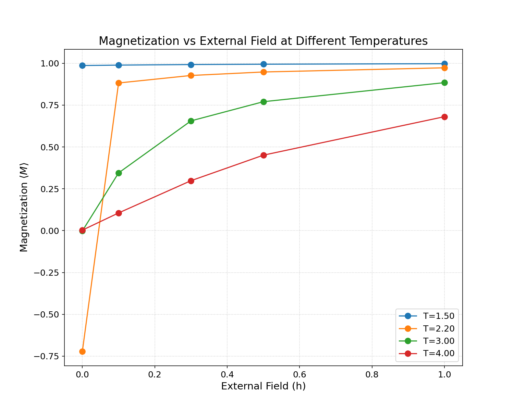

**Analysis of External Field Effects:**

- **Smoothed Transition**: The sharp phase transition at $T_c$ (seen for H=0) is replaced by a smooth crossover when $H > 0$. The external field breaks the symmetry and removes the singularity.
- **Induced Magnetization**: A non-zero magnetization $\langle M \rangle$ exists at all temperatures when $H > 0$. The value increases with $H$ and decreases with $T$. Unlike the H=0 case where $\langle |M| \rangle$ drops to zero above $T_c$, here $\langle M \rangle$ approaches zero more gradually at high temperatures.
- **Suppressed Susceptibility Peak**: The peak in susceptibility $\chi$ near $T_c$ becomes lower and broader as $H$ increases. The field stabilizes the system against large fluctuations.
- **M-H Curve Behavior**: Below $T_c$ (e.g., T=1.5), magnetization saturates quickly even for small fields. Near and above $T_c$ (e.g., T=2.2, T=3.0, T=4.0), magnetization increases more linearly with $H$ initially before eventually saturating at higher fields.

**Animations with External Field (T=2.5):**

| H=0.0 | H=0.3 | H=1.0 |
|:-----:|:-----:|:-----:|
|  | 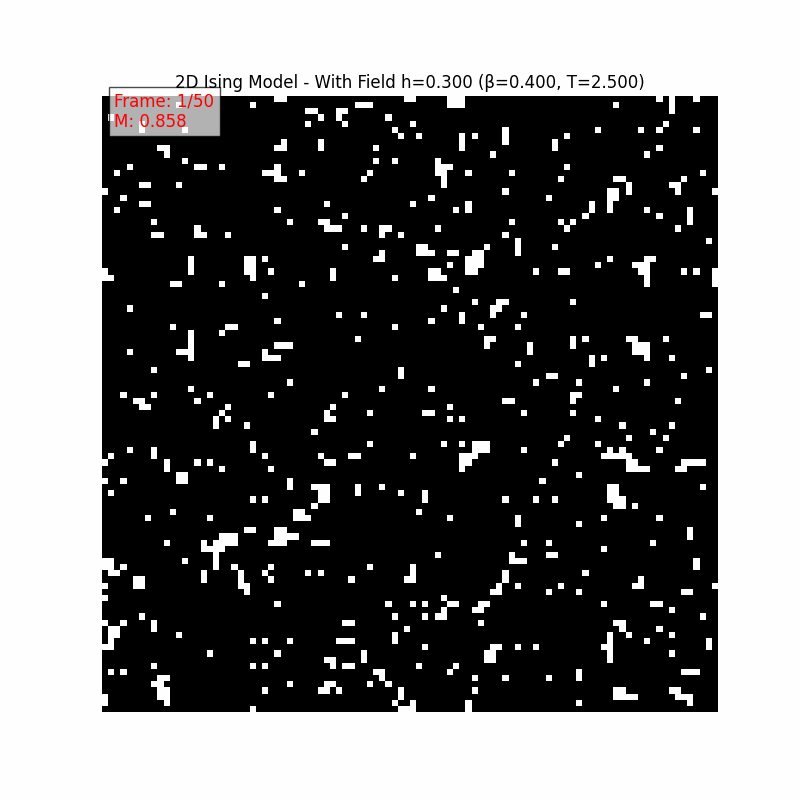 | 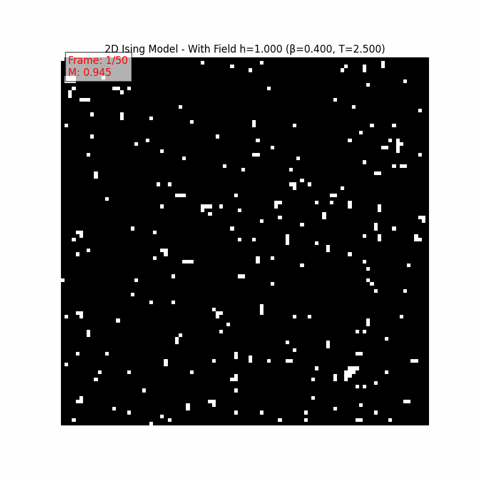 |

- **Visual Bias**: The animations clearly show that as the field strength increases, the lattice becomes more dominated by spins aligned with the field (black pixels for H>0), even above the zero-field critical temperature.

**Conclusion**: Applying an external field fundamentally alters the behavior of the 2D Ising model, eliminating the sharp phase transition and inducing magnetization at all temperatures. Gibbs sampling efficiently captures these effects.

## References

1.  Metropolis, N., Rosenbluth, A. W., Rosenbluth, M. N., Teller, A. H., & Teller, E. (1953). *Equation of State Calculations by Fast Computing Machines*. The Journal of Chemical Physics, 21(6), 1087–1092.
2.  Onsager, L. (1944). *Crystal Statistics. I. A Two-Dimensional Model with an Order-Disorder Transition*. Physical Review, 65(3-4), 117–149.
3.  Newman, M. E. J., & Barkema, G. T. (1999). *Monte Carlo Methods in Statistical Physics*. Oxford University Press.
4.  Geman, S., & Geman, D. (1984). *Stochastic Relaxation, Gibbs Distributions, and the Bayesian Restoration of Images*. IEEE Transactions on Pattern Analysis and Machine Intelligence, 6(6), 721-741.