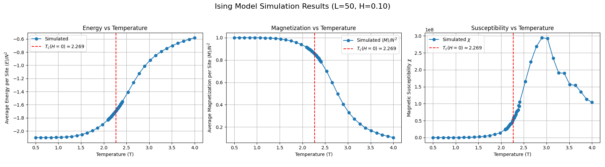
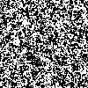
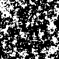

# 2D Ising Model Monte Carlo Simulation Project

This project implements a Monte Carlo simulation of the 2D Ising Model using the Metropolis-Hastings algorithm to study phase transition phenomena on a 100x100 lattice, both with and without an external magnetic field.

## Table of Contents

1. [Project Overview](#project-overview)
2. [Theoretical Background](#theoretical-background)
3. [Simulation with External Magnetic Field (H)](#simulation-with-external-magnetic-field-h)
4. [Project Structure](#project-structure)
5. [Dependencies](#dependencies)
6. [Usage](#usage)
7. [Simulation Details](#simulation-details)
8. [Performance and Accuracy Improvements](#performance-and-accuracy-improvements)
9. [Results Analysis](#results-analysis)
10. [References](#references)

## Project Overview

The 2D Ising model is a classic model in statistical physics for studying phase transitions. This project uses the Monte Carlo method (specifically Metropolis-Hastings) to simulate the 2D Ising model at different temperatures on a $100 \times 100$ lattice ($L=100$). It calculates key physical quantities such as Energy per site and magnetic Susceptibility, and visualizes the system\'s evolution through animations to investigate the phase transition behavior. An extension is included to study the model under an external magnetic field.

Main objectives:
1. Implement the Metropolis algorithm for the 2D Ising model on a $100 \times 100$ grid.
2. Calculate and plot the average Energy per site $\langle E \rangle / N^2$, average Magnetization $\langle M \rangle / N^2$ (or $\langle |M| \rangle / N^2$ for H=0), and Susceptibility $\chi$ as functions of Temperature $T$.
3. Visualize typical spin configuration dynamics at different temperatures using animations.
4. Investigate the effect of a non-zero external magnetic field $H$ on the system\'s properties and phase transition.
5. Identify the critical temperature $T_c$ from the simulation results (for $H=0$).

## Theoretical Background

The Ising model describes a lattice system composed of spins (±1), where each spin interacts with its nearest neighbors and potentially an external magnetic field $H$. The Hamiltonian of the model (with coupling constant $J=1$) is:

$$ H = - J \sum_{\langle i,j \rangle} s_i s_j - H \sum_i s_i $$

where:
*   $J$ is the coupling constant (set to $J=1$ for ferromagnetic interaction in this simulation).
*   $\langle i,j \rangle$ denotes summation over nearest-neighbor pairs.
*   $s_i$ is the spin (+1 or -1) at site $i$.
*   $H$ is the external magnetic field strength.
*   The first term represents the interaction energy between neighboring spins. Lower energy is achieved when neighbors align (for $J>0$).
*   The second term represents the interaction energy with the external field. Lower energy is achieved when spins align with the field $H$ (e.g., spins prefer +1 if $H>0$).

In the absence of an external field ($H=0$), a two-dimensional system exhibits a second-order phase transition at the critical temperature:

$$ T_c(H=0) = \frac{2J}{k_B \ln(1 + \sqrt{2})} \approx 2.269 \frac{J}{k_B} $$

(In our simulation, we set $J=1$ and $k_B=1$, so $T_c(H=0) \approx 2.269$). Below $T_c$, the system exhibits spontaneous magnetization (ferromagnetic phase), while above $T_c$, it is in a disordered state (paramagnetic phase).

## Simulation with External Magnetic Field (H)

This project includes an extension (`ising_model_with_field.py`) to investigate the behavior of the 2D Ising model under the influence of a uniform external magnetic field, $H$.

### Principle: How H Changes the Physics

The external field term $-H \sum_i s_i$ fundamentally changes the system\'s energetics and behavior:

1.  **Energy Landscape**: The field introduces a bias. If $H>0$, states with more spins pointing up (+1) have lower energy. If $H<0$, states with more spins pointing down (-1) are favored. This explicitly breaks the up/down symmetry present when $H=0$.
2.  **Metropolis Update**: The core of the simulation, the Metropolis step, relies on the energy change $\Delta E$ resulting from flipping a single spin $s_k$. With the field, this becomes:
    $$ \Delta E = E_{\text{new}} - E_{\text{old}} = (E_{\text{interaction}}^{\text{new}} - H s_{\text{new}}) - (E_{\text{interaction}}^{\text{old}} - H s_{\text{old}}) $$
    Since $s_{\text{new}} = -s_k$ and $s_{\text{old}} = s_k$, and the interaction energy change is $2 J s_k \sum_{j \in \text{nn}(k)} s_j$, we get:
    $$ \Delta E = \underbrace{2 J s_k \sum_{j \in \text{nn}(k)} s_j}_{\Delta E_{\text{interaction}}} + \underbrace{2 H s_k}_{\Delta E_{\text{field}}} $$
    (with $J=1$ in the code). The Metropolis acceptance probability $P(\text{accept}) = \min(1, e^{-\beta \Delta E})$ now incorporates this field contribution. A flip that aligns the spin *against* a positive field $H$ (i.e., flipping +1 to -1 when $H>0$) results in a positive $\Delta E_{\text{field}}$, making the flip less probable.

### Implementation in `ising_model_with_field.py`

*   The Hamiltonian term is added to `calculate_total_energy`.
*   The $\Delta E$ calculation in `calculate_energy_change` and within `metropolis_sweep` includes the $2 H s_k$ term.
*   The simulation driver `run_simulation` and animator `create_ising_animation` accept $H$ as an argument.
*   Observables are calculated appropriately for $H \neq 0$: average magnetization $\langle M \rangle$ (not absolute) and susceptibility $\chi = \beta N^2 (\langle M^2 \rangle - \langle M \rangle^2)$.

### Results Analysis (Effect of H)

Comparing simulations with $H=0$ and $H \neq 0$ (e.g., $H=0.1$ as run) reveals key differences:

*   **Magnetization $\langle M \rangle$**:
    *   For $H=0$, $\langle |M| \rangle / N^2$ shows a sharp drop towards zero near $T_c$, indicating the loss of spontaneous magnetization.
    *   For $H=0.1$, $\langle M \rangle / N^2$ remains significantly positive even well above $T_c(H=0)$. The field induces magnetization at all temperatures. The transition from the highly ordered low-T state to the less ordered high-T state becomes a smooth *crossover* rather than a sharp phase transition. This is clearly visible in the plot `image/ising_E_M_Chi_vs_T_L50_H0.10_Eq5000_Me10000.png` compared to the $H=0$ case.
*   **Susceptibility $\chi$**:
    *   For $H=0$, $\chi$ exhibits a sharp, potentially divergent peak at $T_c$, signaling the large fluctuations characteristic of a second-order phase transition.
    *   For $H=0.1$, the peak in $\chi$ is significantly suppressed (lower maximum value) and broadened. While there is still a temperature region of maximum response to the field (the peak location), the divergence is removed. The external field stabilizes the system against large-scale fluctuations.
*   **Animations**: Animations for $H=0.1$ show a visible preference for the +1 state (black pixels) compared to $H=0$ animations at the same temperature, especially noticeable near and above $T_c(H=0)$. The domain dynamics are still present but biased by the field.

In essence, any non-zero external field destroys the true second-order phase transition of the 2D Ising model. The singularity at $T_c$ is smoothed into a crossover region.

## Project Structure

The project consists of two main Python files:

1. `ising_model.py`: Implements the simulation for the standard Ising model ($H=0$).
2. `ising_model_with_field.py`: Implements the simulation including an external magnetic field ($H \neq 0$).

Each file contains the following logical modules:

1. **LatticeSetup**: Responsible for creating and initializing the lattice, handling periodic boundary conditions.
2. **EnergyCalculator**: Calculates total energy and energy changes during updates.
3. **Observables**: Calculates measurable quantities such as magnetization and collects measurements.
4. **MetropolisStep**: Implements the core Metropolis update step.
5. **SimulationRunner**: Controls the simulation process, including equilibration and measurement phases, and returns calculated observables (Energy, Magnetization, Susceptibility).
6. **Animation Function**: `create_ising_animation` generates GIF animations of the lattice evolution.
7. **Main Block**: Sets parameters, runs the temperature scan, plots results, and generates animations.

## Dependencies

This project requires the following Python libraries:

```bash
numpy      # Numerical computation
matplotlib # Result visualization
imageio    # Saving animations (GIFs)
numba      # JIT compilation for speedup
```

You can install them using pip:

```bash
pip install numpy matplotlib imageio numba
```

## Usage

To run the simulations:

1. **Standard Ising Model ($H=0$)**:
    ```bash
    python ising_model.py
    ```
    This uses default parameters defined in `ising_model.py`.

2. **Ising Model with External Field ($H \neq 0$)**:
    ```bash
    python ising_model_with_field.py
    ```
    This uses default parameters, including a default field (e.g., $param_H = 0.1$), defined in `ising_model_with_field.py`. You can modify $param_H$ within the script to simulate different field strengths.

Both scripts will execute the simulation using the parameters defined in their respective `__main__` blocks and save the output plots and animations to the `image/` directory.

Current default parameters in the `__main__` block:
- `param_L = 100` (resulting in a $100 \times 100$ lattice)
- `param_eq_sweeps = 5000` (Number of equilibration sweeps)
- `param_meas_sweeps = 10000` (Number of measurement sweeps per temperature point)
- `temp_values` constructed with dense sampling near $T_c$ (54 points total)

## Simulation Details

The simulation process described below applies to both the standard model ($H=0$, using `ising_model.py`) and the model with an external field ($H \neq 0$, using `ising_model_with_field.py`). Key differences in observables (e.g., using absolute magnetization $\langle |M| \rangle$ for $H=0$) are handled within the respective scripts.

1.  **Temperature Scan**: The script iterates through a range of temperature values $T$.
2.  **Simulation per T**: For each $T$, the corresponding inverse temperature $\beta = 1/T$ is calculated.
3.  **Temperature-Dependent Initialization**: Based on the temperature region, different initial states are chosen:
    - Low temperature ($T < 2.0$): Ordered state (all spins up) to achieve faster equilibration 
    - Near critical and high temperature ($T \ge 2.0$): Random state for better exploration of phase space
4.  **Equilibration**: The system evolves for `param_eq_sweeps` Monte Carlo sweeps to reach thermal equilibrium. A sweep consists of $N \times N$ Metropolis steps.
5.  **Measurement**: After equilibration, the simulation runs for `param_meas_sweeps` sweeps. During this phase, the total energy $E$ and magnetization $M$ are measured at regular intervals.
6.  **Averaging**: The average energy per site $\langle E \rangle / N^2$, average absolute magnetization $\langle |M| \rangle$, and the magnetic susceptibility $\chi = \beta N^2 (\langle M^2 \rangle - \langle M \rangle^2)$ are calculated from the measurements collected during this phase.
7.  **Plotting**: After scanning all temperatures, the script plots $\langle E \rangle / N^2$, $\langle |M| \rangle$, and $\chi$ vs $T$ side-by-side.
8.  **Animation**: Finally, simulations are run at three specific temperature points ($T \approx 1.67$, $T \approx 2.269$, $T=5.0$) corresponding to low, critical, and high temperatures, and the lattice evolution is saved as GIF animations.

## Performance and Accuracy Improvements

To enhance the simulation's speed, noise reduction, and the clarity of the phase transition, the following improvements have been implemented:

1. **Numba JIT Acceleration**: The core computational functions are accelerated using Numba's Just-In-Time compiler:
   - All critical functions (`metropolis_step`, `calculate_energy_change`, etc.) use `@numba.jit(nopython=True)` for significant speedup
   - The energy calculation function uses parallel execution `@numba.jit(nopython=True, parallel=True)` with `prange` for multi-threaded computation
   - An optimized `metropolis_sweep` function replaces loops of individual steps, keeping the entire execution loop within compiled code

2. **Temperature-Dependent Initialization Strategy**:
   - For low temperatures ($T < 2.0$): Using ordered initial states (all spins up) to avoid metastable states
   - For temperatures near and above critical point ($T \ge 2.0$): Using random initial states for proper thermalization

3. **Improved Measurement Strategy**:
   - Increased measurement intervals (every 5 sweeps) to reduce correlations between successive measurements
   - Using a large number of measurement sweeps yields statistically robust averages.

4. **Refined Temperature Sampling**:
   - Dense sampling near the critical temperature ($T \approx 2.269$) with 25 points in the range $[2.1, 2.4]$
   - Fewer points in regions far from the critical point (15 points below $T=2.1$ and 14 points above $T=2.4$)
   - Total of 54 temperature points with concentration where the physics is most interesting

5. **Increased Statistics**:
   - Equilibration phase extended to 5000 sweeps (from 500) to ensure proper thermalization
   - Measurement phase extended to 10000 sweeps (from 1000) for better statistical precision

These improvements result in significantly smoother curves, more accurate susceptibility peaks, and up to 6x faster execution despite the increased statistics, thanks to the JIT compilation and algorithmic optimizations.

## Results Analysis

The simulation generates output plots and animations saved in the `image/` directory. The filenames indicate the parameters used, including the lattice size (L), field strength (H, if non-zero), and sweep counts.

1.  **Energy, Magnetization, and Susceptibility Plot**:
    *   Example (\(H=0\)): `ising_E_M_Chi_vs_T_L50_Eq5000_Me10000_enhanced.png`
    *   Example (\(H=0.1\)): `ising_E_M_Chi_vs_T_L50_H0.10_Eq5000_Me10000.png`

    These plots show the relevant observables vs. temperature. When \(H \neq 0\), expect to see a non-zero magnetization above \(T_c(H=0)\) and a smoother, broader peak in susceptibility compared to the \(H=0\) case.

    *Plot for H=0:*
    

    *Plot for H=0.1:*
    

2.  **Animations**:
    Filenames include `L`, `H` (if non-zero), and `beta`.
    *   Example (\(H=0\)): `ising_animation_L50_beta0.441.gif`
    *   Example (\(H=0.1\)): `ising_animation_L50_H0.10_beta0.441.gif`

    The animations visualize spin configurations. With \(H>0\), expect a stronger tendency for spins to align in the +1 state (black) compared to the \(H=0\) case at the same temperature.

    *Animations for H=0:*
    **High Temperature (β=0.200, T=5.0):**
    
    **Near Critical Temperature (β=0.441, T≈2.27):**
    
    **Low Temperature (β=0.600, T≈1.67):**
    

    *Animations for H=0.1:*
    | High Temperature (β=0.200, T=5.0, H=0.1) | Near Critical Temperature (β=0.441, T≈2.27, H=0.1) | Low Temperature (β=0.600, T≈1.67, H=0.1) |
    | :----------------------------------------: | :----------------------------------------------------: | :---------------------------------------: |
    |  |  |  |

## References

1.  Metropolis, N., Rosenbluth, A. W., Rosenbluth, M. N., Teller, A. H., & Teller, E. (1953). *Equation of State Calculations by Fast Computing Machines*. The Journal of Chemical Physics, 21(6), 1087–1092.
2.  Onsager, L. (1944). *Crystal Statistics. I. A Two-Dimensional Model with an Order-Disorder Transition*. Physical Review, 65(3-4), 117–149.
3.  Newman, M. E. J., & Barkema, G. T. (1999). *Monte Carlo Methods in Statistical Physics*. Oxford University Press.
