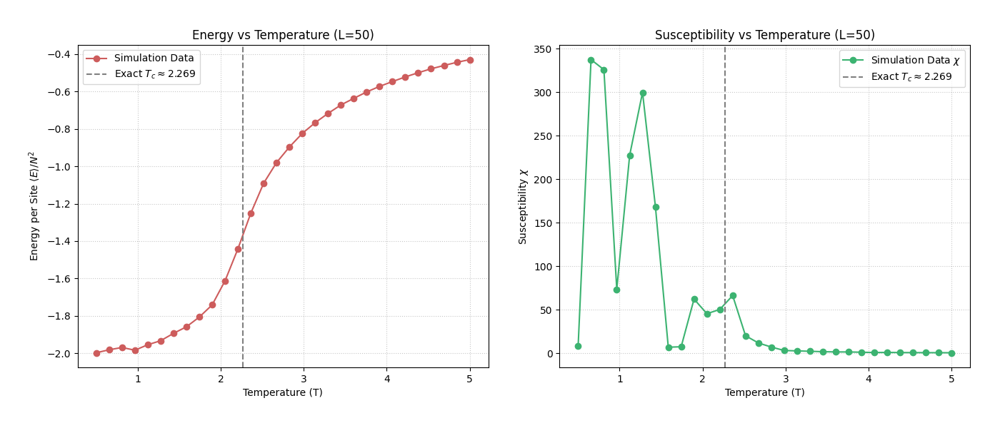
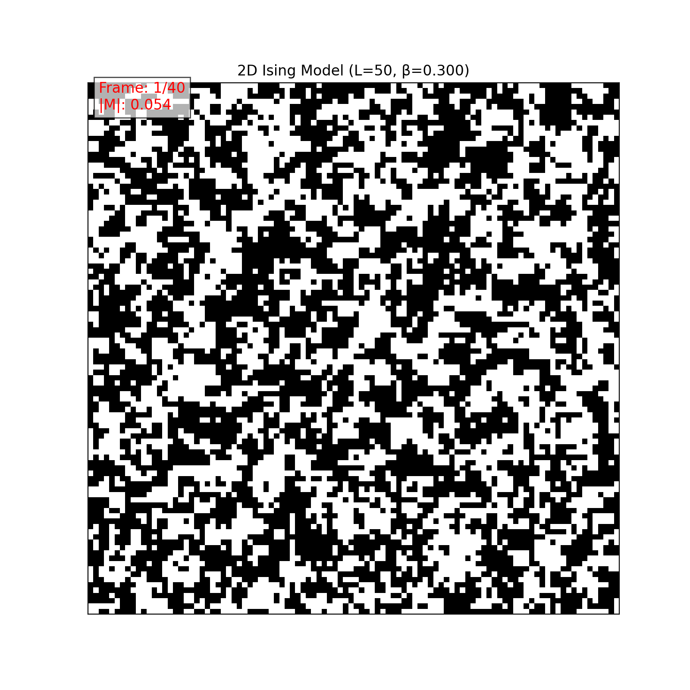
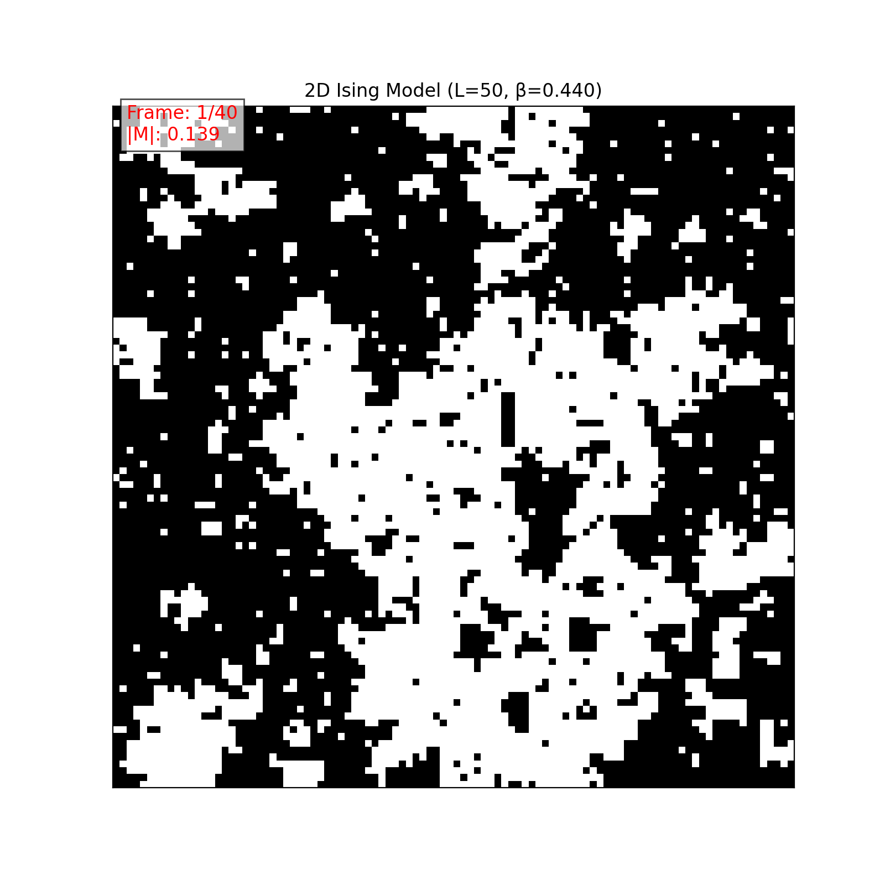
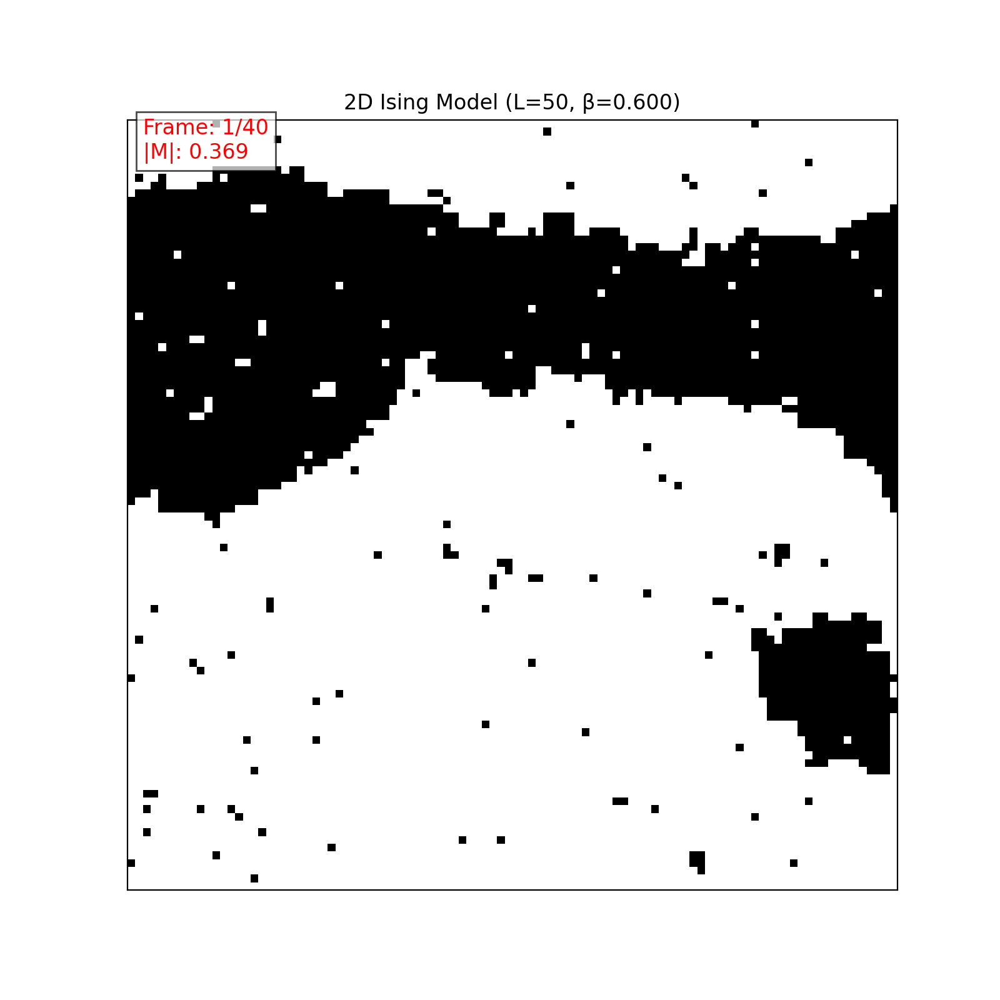

# 2D Ising Model Monte Carlo Simulation Project

This project implements a Monte Carlo simulation of the 2D Ising Model using the Metropolis-Hastings algorithm to study phase transition phenomena on a 100x100 lattice.

## Table of Contents

1. [Project Overview](#project-overview)
2. [Theoretical Background](#theoretical-background)
3. [Project Structure](#project-structure)
4. [Dependencies](#dependencies)
5. [Usage](#usage)
6. [Simulation Details](#simulation-details)
7. [Results Analysis](#results-analysis)
8. [References](#references)

## Project Overview

The 2D Ising model is a classic model in statistical physics for studying phase transitions. This project uses the Monte Carlo method (specifically Metropolis-Hastings) to simulate the 2D Ising model at different temperatures on a \(100 \\times 100\) lattice (\(L=50\)). It calculates key physical quantities such as Energy per site and magnetic Susceptibility, and visualizes the system's evolution through animations to investigate the phase transition behavior.

Main objectives:
1. Implement the Metropolis algorithm for the 2D Ising model on a \(100 \\times 100\) grid.
2. Calculate and plot the average Energy per site \(\\langle E \\rangle / N^2\) and Susceptibility \(\\chi\) as functions of Temperature \(T\).
3. Visualize typical spin configuration dynamics at different temperatures using animations.
4. Identify the critical temperature \(T_c\) from the simulation results.

## Theoretical Background

The Ising model describes a lattice system composed of spins (±1), where each spin interacts with its nearest neighbors. The Hamiltonian of the model (with \(J=1\)) is:

\[ H = - \\sum_{\\langle i,j \\rangle} s_i s_j \]

where \(\\langle i,j \\rangle\) denotes summation over nearest-neighbor pairs. In a two-dimensional system, the theoretically predicted critical temperature is:

\[ T_c = \\frac{2}{\\ln(1 + \\sqrt{2})} \\approx 2.269... \]

Below \(T_c\), the system exhibits spontaneous magnetization (ferromagnetic phase), while above \(T_c\), it is in a disordered state (paramagnetic phase).

## Project Structure

The project consists primarily of a Python file `ising_model.py`, which contains the following logical modules:

1.  **LatticeSetup**: Responsible for creating and initializing the lattice, handling periodic boundary conditions.
2.  **EnergyCalculator**: Calculates total energy and energy changes during updates.
3.  **Observables**: Calculates measurable quantities such as magnetization and collects measurements.
4.  **MetropolisStep**: Implements the core Metropolis update step.
5.  **SimulationRunner**: Controls the simulation process, including equilibration and measurement phases, and returns calculated observables (Energy, Magnetization, Susceptibility).
6.  **Animation Function**: `create_ising_animation` generates GIF animations of the lattice evolution.
7.  **Main Block**: Sets parameters, runs the temperature scan, plots results, and generates animations.

## Dependencies

This project requires the following Python libraries:

```bash
numpy      # Numerical computation
matplotlib # Result visualization
imageio    # Saving animations (GIFs)
```

You can install them using pip:

```bash
pip install numpy matplotlib imageio
```

## Usage

To run the complete simulation (temperature scan, plotting, and animation generation):

```bash
python ising_model.py
```

This will execute the simulation using the default parameters defined in the script and save the output plots and animations.

Current default parameters in the `__main__` block:
- `param_L = 50` (resulting in a \(N=2L=100 \\times 100\) lattice)
- `param_eq_sweeps = 500` (Number of equilibration sweeps)
- `param_meas_sweeps = 1000` (Number of measurement sweeps per temperature point)
- `temp_values = np.linspace(0.5, 5.0, 30)` (Range of temperatures T to scan)

## Simulation Details

The simulation proceeds as follows:

1.  **Temperature Scan**: The script iterates through a range of temperature values \(T\).
2.  **Simulation per T**: For each \(T\), the corresponding inverse temperature \(\\beta = 1/T\) is calculated.
3.  **Equilibration**: The system evolves for `param_eq_sweeps` Monte Carlo sweeps to reach thermal equilibrium. A sweep consists of \(N \\times N\) Metropolis steps.
4.  **Measurement**: After equilibration, the simulation runs for `param_meas_sweeps` sweeps. During this phase, the total energy \(E\) and magnetization \(M\) are measured after each sweep.
5.  **Averaging**: The average energy per site \(\\langle E \\rangle / N^2\) and the magnetic susceptibility \(\\chi = \\beta N^2 (\\langle M^2 \\rangle - \\langle M \\rangle^2)\) are calculated from the measurements collected during this phase.
6.  **Plotting**: After scanning all temperatures, the script plots \(\\langle E \\rangle / N^2\) vs \(T\) and \(\\chi\) vs \(T\).
7.  **Animation**: Finally, simulations are run at three specific \(\\beta\) values (0.3, 0.44, 0.6) corresponding to high, critical, and low temperatures, and the lattice evolution is saved as GIF animations.

## Results Analysis

The simulation generates the following output files:

1.  **Energy and Susceptibility Plot**: `ising_E_Chi_vs_T_L50_Eq500_Me1000.png`
    This plot shows the average energy per site and the magnetic susceptibility as functions of temperature.
    - The energy plot shows a continuous change but with a steep slope (indicating high specific heat) near \(T_c\).
    - The susceptibility plot exhibits a sharp peak near the theoretical critical temperature \(T_c \\approx 2.269\), clearly signaling the phase transition.

    

2.  **Animations**:
    - `ising_animation_L50_beta0.300.gif` (High Temperature, \(T \\approx 3.33\))
    - `ising_animation_L50_beta0.440.gif` (Near Critical Temperature, \(T \\approx 2.27\))
    - `ising_animation_L50_beta0.600.gif` (Low Temperature, \(T \\approx 1.67\))

    These animations visualize the spin configurations (white for -1, black for +1) evolving over time:
    - **High Temperature**: Shows a rapidly fluctuating, disordered state (paramagnetic phase).
    - **Near Critical Temperature**: Displays large-scale fluctuations with clusters of spins of various sizes forming and dissolving, characteristic of critical phenomena.
    - **Low Temperature**: Shows the system quickly settling into a highly ordered state (ferromagnetic phase) with large domains of aligned spins.

    **High Temperature (β=0.300, T≈3.33):**
    

    **Near Critical Temperature (β=0.440, T≈2.27):**
    

    **Low Temperature (β=0.600, T≈1.67):**
    

## References

1.  Metropolis, N., Rosenbluth, A. W., Rosenbluth, M. N., Teller, A. H., & Teller, E. (1953). *Equation of State Calculations by Fast Computing Machines*. The Journal of Chemical Physics, 21(6), 1087–1092.
2.  Onsager, L. (1944). *Crystal Statistics. I. A Two-Dimensional Model with an Order-Disorder Transition*. Physical Review, 65(3-4), 117–149.
3.  Newman, M. E. J., & Barkema, G. T. (1999). *Monte Carlo Methods in Statistical Physics*. Oxford University Press.
