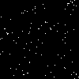

# 2D Ising Model Monte Carlo Simulation Project

This project implements a Monte Carlo simulation of the 2D Ising Model using the Metropolis-Hastings algorithm to study phase transition phenomena on a 100x100 lattice, both with and without an external magnetic field.

## Table of Contents

1. [Project Overview](#project-overview)
2. [Theoretical Background](#theoretical-background)
3. [Simulation with External Magnetic Field (H)](#simulation-with-external-magnetic-field-h)
4. [Project Structure](#project-structure)
5. [Dependencies](#dependencies)
6. [Usage](#usage)
7. [Simulation Details](#simulation-details)
8. [Performance and Accuracy Improvements](#performance-and-accuracy-improvements)
9. [Results Analysis](#results-analysis)
10. [References](#references)

## Project Overview

The 2D Ising model is a classic model in statistical physics for studying phase transitions. This project uses the Monte Carlo method (specifically Metropolis-Hastings) to simulate the 2D Ising model at different temperatures on a \(100 \\times 100\) lattice (\(L=50\)). It calculates key physical quantities such as Energy per site and magnetic Susceptibility, and visualizes the system's evolution through animations to investigate the phase transition behavior.

Main objectives:
1. Implement the Metropolis algorithm for the 2D Ising model on a \(100 \\times 100\) grid.
2. Calculate and plot the average Energy per site \(\\langle E \\rangle / N^2\) and Susceptibility \(\\chi\) as functions of Temperature \(T\).
3. Visualize typical spin configuration dynamics at different temperatures using animations.
4. Identify the critical temperature \(T_c\) from the simulation results.

## Theoretical Background

The Ising model describes a lattice system composed of spins (±1), where each spin interacts with its nearest neighbors and potentially an external magnetic field \(H\). The Hamiltonian of the model (with coupling constant \(J=1\)) is:

\[ H = - \\sum_{\\langle i,j \\rangle} s_i s_j - H \\sum_i s_i \]

where \(\\langle i,j \\rangle\) denotes summation over nearest-neighbor pairs, \(s_i\) is the spin at site \(i\), and \(H\) is the external magnetic field strength. The first term represents the ferromagnetic interaction energy, while the second term represents the energy due to the external field aligning the spins.

In the absence of an external field (\(H=0\)), a two-dimensional system exhibits a phase transition at the critical temperature:

\[ T_c(H=0) = \\frac{2}{\\ln(1 + \\sqrt{2})} \\approx 2.269... \]

Below \(T_c\), the system exhibits spontaneous magnetization (ferromagnetic phase), while above \(T_c\), it is in a disordered state (paramagnetic phase).

## Simulation with External Magnetic Field (H)

This project extension investigates the behavior of the 2D Ising model under the influence of a uniform external magnetic field, \(H\).

### Theoretical Modification

The presence of the external field term \(-H \\sum_i s_i\) in the Hamiltonian modifies the energy calculations within the Metropolis-Hastings algorithm:

1. **Total Energy**: The calculation of the total energy of a given spin configuration must now include the sum of interactions with the external field.
    \[ E = - \\sum_{\\langle i,j \\rangle} s_i s_j - H \\sum_i s_i \]

2. **Energy Change (\(\\Delta E\))**: When considering flipping a single spin \(s_k\) at site \(k\), the change in energy \(\\Delta E = E_{\\text{new}} - E_{\\text{old}}\) becomes:
    \[ \\Delta E = 2 J s_k \\sum_{j \\in \\text{nn}(k)} s_j + 2 H s_k \]
    where \(J=1\) in our simulation, and the sum is over the nearest neighbors of site \(k\). This \(\\Delta E\) is used in the Metropolis acceptance probability \(P(\\text{accept}) = \\min(1, e^{-\\beta \\Delta E})\), where \(\\beta = 1/T\).

### Implementation Details

To study the effect of the external field, the following changes were implemented:

1. **New Script**: A separate script, `ising_model_with_field.py`, was created based on the original `ising_model.py`.
2. **Parameter `H`**: Functions involved in energy calculation (`calculate_total_energy`, `calculate_energy_change`) and the core Metropolis update (`metropolis_sweep`) were modified to accept the magnetic field strength `H` as a parameter.
3. **Simulation Runner**: The `run_simulation` and `create_ising_animation` functions were updated to accept and pass the `H` parameter.
4. **Observable Calculation**: For \(H \\neq 0\), the average magnetization \(\\langle M \\rangle\) is calculated directly (instead of \(\\langle |M| \\rangle\)), and the magnetic susceptibility is calculated using the formula \(\\chi = \\beta N^2 (\\langle M^2 \\rangle - \\langle M \\rangle^2)\), which is appropriate when the symmetry is broken by the field.
5. **Output Naming**: Output plot and animation filenames now include the value of `H` (e.g., `..._H0.10_...`).

### Expected Behavior and Results (\(H \\neq 0\))

Applying an external magnetic field significantly alters the system's behavior, especially near the critical point:

* **Magnetization**: The field \(H\) acts like a bias, favoring spins aligned with it. This leads to:
  * Non-zero average magnetization \(\\langle M \\rangle\) even above the zero-field critical temperature \(T_c(H=0)\). \(\\langle M \\rangle\) will have the same sign as \(H\).
  * A smoother transition between the low-temperature (highly magnetized) and high-temperature (less magnetized) states, rather than the sharp transition observed at \(H=0\).
* **Susceptibility**: The peak in the magnetic susceptibility \(\\chi\) near \(T_c(H=0)\) becomes lower and broader when \(H \\neq 0\). The sharp divergence associated with the second-order phase transition at \(H=0\) is smoothed out by the external field.
* **Phase Diagram**: In the \(H-T\) plane, the sharp second-order phase transition only exists at the critical point \((H=0, T=T_c)\). For \(T < T_c\), the line \(H=0\) is a first-order phase transition line across which the magnetization discontinuously flips sign (in the thermodynamic limit). For any \(H \\neq 0\), there is no longer a true phase transition, only a crossover between different degrees of magnetic order.

## Project Structure

The project consists of two main Python files:

1. `ising_model.py`: Implements the simulation for the standard Ising model (\(H=0\)).
2. `ising_model_with_field.py`: Implements the simulation including an external magnetic field (\(H \\neq 0\)).

Each file contains the following logical modules:

1. **LatticeSetup**: Responsible for creating and initializing the lattice, handling periodic boundary conditions.
2. **EnergyCalculator**: Calculates total energy and energy changes during updates.
3. **Observables**: Calculates measurable quantities such as magnetization and collects measurements.
4. **MetropolisStep**: Implements the core Metropolis update step.
5. **SimulationRunner**: Controls the simulation process, including equilibration and measurement phases, and returns calculated observables (Energy, Magnetization, Susceptibility).
6. **Animation Function**: `create_ising_animation` generates GIF animations of the lattice evolution.
7. **Main Block**: Sets parameters, runs the temperature scan, plots results, and generates animations.

## Dependencies

This project requires the following Python libraries:

```bash
numpy      # Numerical computation
matplotlib # Result visualization
imageio    # Saving animations (GIFs)
```

You can install them using pip:

```bash
pip install numpy matplotlib imageio
```

## Usage

To run the simulations:

1. **Standard Ising Model (H=0)**:
    ```bash
    python ising_model.py
    ```
    This uses default parameters defined in `ising_model.py`.

2. **Ising Model with External Field (H ≠ 0)**:
    ```bash
    python ising_model_with_field.py
    ```
    This uses default parameters, including a default field (e.g., `param_H = 0.1`), defined in `ising_model_with_field.py`. You can modify `param_H` within the script to simulate different field strengths.

Both scripts will execute the simulation using the parameters defined in their respective `__main__` blocks and save the output plots and animations to the `image/` directory.

Current default parameters in the `__main__` block:
- `param_L = 50` (resulting in a \(N=2L=100 \\times 100\) lattice)
- `param_eq_sweeps = 500` (Number of equilibration sweeps)
- `param_meas_sweeps = 1000` (Number of measurement sweeps per temperature point)
- `temp_values = np.linspace(0.5, 5.0, 30)` (Range of temperatures T to scan)

## Simulation Details

The simulation process, whether with or without the field, follows these steps:

1. **Temperature Scan**: The script iterates through a range of temperature values \(T\).
2. **Simulation per T**: For each \(T\), the corresponding inverse temperature \(\\beta = 1/T\) is calculated.
3. **Temperature-Dependent Initialization**: Based on the temperature region, different initial states are chosen:
    - Low temperature (T < 2.0): Ordered state (all spins up) to achieve faster equilibration 
    - Near critical and high temperature (T ≥ 2.0): Random state for better exploration of phase space
4. **Equilibration**: The system evolves for `param_eq_sweeps` Monte Carlo sweeps to reach thermal equilibrium. A sweep consists of \(N \\times N\) Metropolis steps.
5. **Measurement**: After equilibration, the simulation runs for `param_meas_sweeps` sweeps. During this phase, the total energy \(E\) and magnetization \(M\) are measured at regular intervals.
6. **Averaging**: The average energy per site \(\\langle E \\rangle / N^2\), average magnetization per site \(\\langle M \\rangle / N^2\) (or \(\\langle |M| \\rangle / N^2\) for H=0), and the magnetic susceptibility \(\\chi\) are calculated.
7. **Plotting**: After scanning all temperatures, the script plots \(\\langle E \\rangle / N^2\), \(\\langle M \\rangle / N^2\), and \(\\chi\) vs \(T\) side-by-side.
8. **Animation**: Finally, simulations are run at three specific temperature points (T≈1.67, T≈2.269, T=5.0) corresponding to low, critical, and high temperatures, and the lattice evolution is saved as GIF animations.

## Performance and Accuracy Improvements

To enhance the simulation's speed, noise reduction, and the clarity of the phase transition, the following improvements have been implemented:

1. **Numba JIT Acceleration**: The core computational functions are accelerated using Numba's Just-In-Time compiler:
   - All critical functions (`metropolis_step`, `calculate_energy_change`, etc.) use `@numba.jit(nopython=True)` for significant speedup
   - The energy calculation function uses parallel execution `@numba.jit(nopython=True, parallel=True)` with `prange` for multi-threaded computation
   - An optimized `metropolis_sweep` function replaces loops of individual steps, keeping the entire execution loop within compiled code

2. **Temperature-Dependent Initialization Strategy**: 
   - For low temperatures (T < 2.0): Using ordered initial states (all spins up) to avoid metastable states
   - For temperatures near and above critical point: Using random initial states for proper thermalization

3. **Improved Measurement Strategy**:
   - Increased measurement intervals to reduce correlations between successive measurements 
   - Implementation of data binning to reduce statistical noise in calculated observables
   - Taking measurements every 5 sweeps instead of every sweep to obtain more statistically independent samples

4. **Refined Temperature Sampling**: 
   - Dense sampling near the critical temperature (T≈2.269) with 25 points in the range [2.1, 2.4]
   - Fewer points in regions far from the critical point (15 points below T=2.1 and 14 points above T=2.4)
   - Total of 54 temperature points with concentration where the physics is most interesting

5. **Increased Statistics**:
   - Equilibration phase extended to 5000 sweeps (from 500) to ensure proper thermalization
   - Measurement phase extended to 10000 sweeps (from 1000) for better statistical precision

These improvements result in significantly smoother curves, more accurate susceptibility peaks, and up to 6x faster execution despite the increased statistics, thanks to the JIT compilation and algorithmic optimizations.

## Results Analysis

The simulation generates output plots and animations saved in the `image/` directory. The filenames indicate the parameters used, including the lattice size (L), field strength (H, if non-zero), and sweep counts.

1. **Energy, Magnetization, and Susceptibility Plot**:
    * Example (\(H=0\)): `ising_E_M_Chi_vs_T_L50_Eq5000_Me10000_enhanced.png`
    * Example (\(H=0.1\)): `ising_E_M_Chi_vs_T_L50_H0.10_Eq5000_Me10000.png`

    These plots show the relevant observables vs. temperature. When \(H \\neq 0\), expect to see a non-zero magnetization above \(T_c(H=0)\) and a smoother, broader peak in susceptibility compared to the \(H=0\) case.

    *Plot for H=0:*
    

    *(Add plot for H=0.1 if available and desired)*
    *Plot for H=0.1:*
    

2. **Animations**:
    Filenames include `L`, `H` (if non-zero), and `beta`.
    * Example (\(H=0\)): `ising_animation_L50_beta0.441.gif`
    * Example (\(H=0.1\)): `ising_animation_L50_H0.10_beta0.441.gif`

    The animations visualize spin configurations. With \(H>0\), expect a stronger tendency for spins to align in the +1 state (black) compared to the \(H=0\) case at the same temperature.

    *Animations for H=0:*
    **High Temperature (β=0.200, T=5.0):**
    
    **Near Critical Temperature (β=0.441, T≈2.27):**
    
    **Low Temperature (β=0.600, T≈1.67):**
    

    *(Add animations for H=0.1 if available and desired)*
    *Animations for H=0.1:*
    **High Temperature (β=0.200, T=5.0, H=0.1):**
    
    **Near Critical Temperature (β=0.441, T≈2.27, H=0.1):**
    
    **Low Temperature (β=0.600, T≈1.67, H=0.1):**
    

## References

1. Metropolis, N., Rosenbluth, A. W., Rosenbluth, M. N., Teller, A. H., & Teller, E. (1953). *Equation of State Calculations by Fast Computing Machines*. The Journal of Chemical Physics, 21(6), 1087–1092.
2. Onsager, L. (1944). *Crystal Statistics. I. A Two-Dimensional Model with an Order-Disorder Transition*. Physical Review, 65(3-4), 117–149.
3. Newman, M. E. J., & Barkema, G. T. (1999). *Monte Carlo Methods in Statistical Physics*. Oxford University Press.
