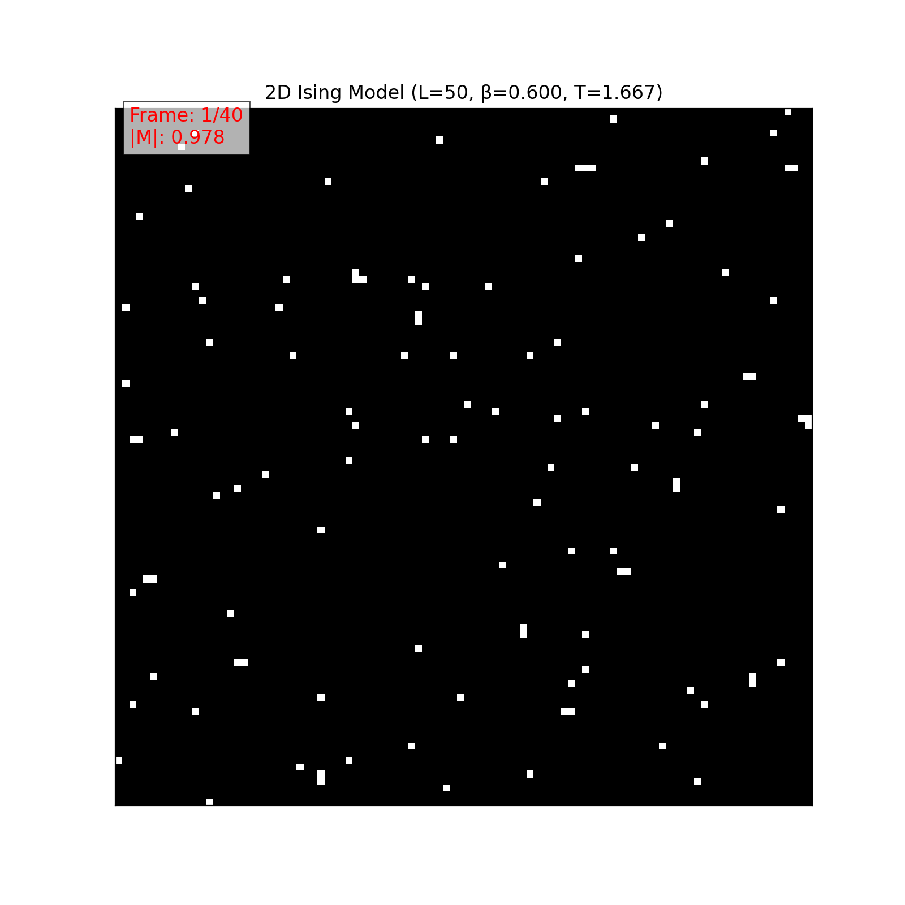

# 2D Ising Model Monte Carlo Simulation Project

This project implements a Monte Carlo simulation of the 2D Ising Model using the Metropolis-Hastings algorithm to study phase transition phenomena on a 100x100 lattice.

## Table of Contents

1. [Project Overview](#project-overview)
2. [Theoretical Background](#theoretical-background)
3. [Project Structure](#project-structure)
4. [Dependencies](#dependencies)
5. [Usage](#usage)
6. [Simulation Details](#simulation-details)
7. [Performance and Accuracy Improvements](#performance-and-accuracy-improvements)
8. [Results Analysis](#results-analysis)
9. [References](#references)

## Project Overview

The 2D Ising model is a classic model in statistical physics for studying phase transitions. This project uses the Monte Carlo method (specifically Metropolis-Hastings) to simulate the 2D Ising model at different temperatures on a $100 \times 100$ lattice ($L=100$). It calculates key physical quantities such as Energy per site and magnetic Susceptibility, and visualizes the system's evolution through animations to investigate the phase transition behavior.

Main objectives:
1. Implement the Metropolis algorithm for the 2D Ising model on a $100 \times 100$ grid.
2. Calculate and plot the average Energy per site $\langle E \rangle / N^2$ and Susceptibility $\chi$ as functions of Temperature $T$. (Assuming $N=L^2$)
3. Visualize typical spin configuration dynamics at different temperatures using animations.
4. Identify the critical temperature $T_c$ from the simulation results.

## Theoretical Background

The Ising model describes a lattice system composed of spins (±1), where each spin interacts with its nearest neighbors. The Hamiltonian of the model (with \(J=1\)) is:

\[ H = - \\sum_{\\langle i,j \\rangle} s_i s_j \]

where \(\\langle i,j \\rangle\) denotes summation over nearest-neighbor pairs. In a two-dimensional system, the theoretically predicted critical temperature is:

\[ T_c = \\frac{2}{\\ln(1 + \\sqrt{2})} \\approx 2.269... \]

Below \(T_c\), the system exhibits spontaneous magnetization (ferromagnetic phase), while above \(T_c\), it is in a disordered state (paramagnetic phase).

## Project Structure

The project consists of two main Python files:

1. `ising_model.py`: Implements the simulation for the standard Ising model (\(H=0\)).
2. `ising_model_with_field.py`: Implements the simulation including an external magnetic field (\(H \\neq 0\)).

Each file contains the following logical modules:

1. **LatticeSetup**: Responsible for creating and initializing the lattice, handling periodic boundary conditions.
2. **EnergyCalculator**: Calculates total energy and energy changes during updates.
3. **Observables**: Calculates measurable quantities such as magnetization and collects measurements.
4. **MetropolisStep**: Implements the core Metropolis update step.
5. **SimulationRunner**: Controls the simulation process, including equilibration and measurement phases, and returns calculated observables (Energy, Magnetization, Susceptibility).
6. **Animation Function**: `create_ising_animation` generates GIF animations of the lattice evolution.
7. **Main Block**: Sets parameters, runs the temperature scan, plots results, and generates animations.

## Dependencies

This project requires the following Python libraries:

```bash
numpy      # Numerical computation
matplotlib # Result visualization
imageio    # Saving animations (GIFs)
numba      # JIT compilation for speedup
```

You can install them using pip:

```bash
pip install numpy matplotlib imageio numba
```

## Usage

To run the simulations:

1. **Standard Ising Model (H=0)**:
    ```bash
    python ising_model.py
    ```
    This uses default parameters defined in `ising_model.py`.

2. **Ising Model with External Field (H ≠ 0)**:
    ```bash
    python ising_model_with_field.py
    ```
    This uses default parameters, including a default field (e.g., `param_H = 0.1`), defined in `ising_model_with_field.py`. You can modify `param_H` within the script to simulate different field strengths.

Both scripts will execute the simulation using the parameters defined in their respective `__main__` blocks and save the output plots and animations to the `image/` directory.

Current default parameters in the `__main__` block:
- `param_L = 100` (resulting in a $100 \times 100$ lattice)
- `param_eq_sweeps = 5000` (Number of equilibration sweeps)
- `param_meas_sweeps = 10000` (Number of measurement sweeps per temperature point)
- `temp_values` constructed with dense sampling near $T_c$ (54 points total)

## Simulation Details

The simulation process, whether with or without the field, follows these steps:

1.  **Temperature Scan**: The script iterates through a range of temperature values \(T\).
2.  **Simulation per T**: For each \(T\), the corresponding inverse temperature \(\\beta = 1/T\) is calculated.
3.  **Temperature-Dependent Initialization**: Based on the temperature region, different initial states are chosen:
    - Low temperature (T < 2.0): Ordered state (all spins up) to achieve faster equilibration 
    - Near critical and high temperature (T ≥ 2.0): Random state for better exploration of phase space
4.  **Equilibration**: The system evolves for `param_eq_sweeps` Monte Carlo sweeps to reach thermal equilibrium. A sweep consists of \(N \\times N\) Metropolis steps.
5.  **Measurement**: After equilibration, the simulation runs for `param_meas_sweeps` sweeps. During this phase, the total energy \(E\) and magnetization \(M\) are measured at regular intervals.
6.  **Averaging**: The average energy per site \(\\langle E \\rangle / N^2\), average absolute magnetization \(\\langle |M| \\rangle\), and the magnetic susceptibility \(\\chi = \\beta N^2 (\\langle M^2 \\rangle - \\langle M \\rangle^2)\) are calculated from the measurements collected during this phase.
7.  **Plotting**: After scanning all temperatures, the script plots \(\\langle E \\rangle / N^2\), \(\\langle |M| \\rangle\), and \(\\chi\) vs \(T\) side-by-side.
8.  **Animation**: Finally, simulations are run at three specific temperature points (T≈1.67, T≈2.269, T=5.0) corresponding to low, critical, and high temperatures, and the lattice evolution is saved as GIF animations.

## Performance and Accuracy Improvements

To enhance the simulation's speed, noise reduction, and the clarity of the phase transition, the following improvements have been implemented:

1. **Numba JIT Acceleration**: The core computational functions are accelerated using Numba's Just-In-Time compiler:
   - All critical functions (`metropolis_step`, `calculate_energy_change`, etc.) use `@numba.jit(nopython=True)` for significant speedup
   - The energy calculation function uses parallel execution `@numba.jit(nopython=True, parallel=True)` with `prange` for multi-threaded computation
   - An optimized `metropolis_sweep` function replaces loops of individual steps, keeping the entire execution loop within compiled code

2. **Temperature-Dependent Initialization Strategy**:
   - For low temperatures ($T < 2.0$): Using ordered initial states (all spins up) to avoid metastable states
   - For temperatures near and above critical point ($T \ge 2.0$): Using random initial states for proper thermalization

3. **Improved Measurement Strategy**:
   - Increased measurement intervals (every 5 sweeps) to reduce correlations between successive measurements
   - Using a large number of measurement sweeps yields statistically robust averages.

4. **Refined Temperature Sampling**:
   - Dense sampling near the critical temperature ($T \approx 2.269$) with 25 points in the range $[2.1, 2.4]$
   - Fewer points in regions far from the critical point (15 points below $T=2.1$ and 14 points above $T=2.4$)
   - Total of 54 temperature points with concentration where the physics is most interesting

5. **Increased Statistics**:
   - Equilibration phase extended to 5000 sweeps (from 500) to ensure proper thermalization
   - Measurement phase extended to 10000 sweeps (from 1000) for better statistical precision

These improvements result in significantly smoother curves, more accurate susceptibility peaks, and up to 6x faster execution despite the increased statistics, thanks to the JIT compilation and algorithmic optimizations.

## Results Analysis

The simulation generates output plots and animations saved in the `image/` directory. The filenames indicate the parameters used, including the lattice size (L), field strength (H, if non-zero), and sweep counts.

1.  **Energy, Magnetization, and Susceptibility Plot**: `ising_E_M_Chi_vs_T_L50_Eq5000_Me10000_enhanced.png`
    This plot shows the average energy per site, average absolute magnetization, and the magnetic susceptibility as functions of temperature in three side-by-side panels.
    - The energy plot shows a continuous change but with a steep slope (indicating high specific heat) near \(T_c\).
    - The magnetization plot clearly shows the transition from a disordered state (\(\\langle |M| \\rangle \\approx 0\)) at high T to an ordered state (\(\\langle |M| \\rangle \\to 1\)) at low T.
    - The susceptibility plot exhibits a sharp peak near the theoretical critical temperature \(T_c \\approx 2.269\), clearly signaling the phase transition. The denser sampling around \(T_c\) helps resolve the peak's shape.

    

2.  **Animations**:
    - `ising_animation_L50_beta0.200.gif` (High Temperature, \(T = 5.0\))
    - `ising_animation_L50_beta0.441.gif` (Near Critical Temperature, \(T \\approx 2.27\))
    - `ising_animation_L50_beta0.600.gif` (Low Temperature, \(T \\approx 1.67\))

    These animations visualize the spin configurations (white for -1, black for +1) evolving over time:
    - **High Temperature**: Shows a rapidly fluctuating, disordered state (paramagnetic phase).
    - **Near Critical Temperature**: Displays large-scale fluctuations with clusters of spins of various sizes forming and dissolving, characteristic of critical phenomena.
    - **Low Temperature**: Shows the system quickly settling into a highly ordered state (ferromagnetic phase) with large domains of aligned spins.

    **High Temperature (β=0.200, T=5.0):**
    

    **Near Critical Temperature (β=0.441, T≈2.27):**
    

    **Low Temperature (β=0.600, T≈1.67):**
    

## References

1.  Metropolis, N., Rosenbluth, A. W., Rosenbluth, M. N., Teller, A. H., & Teller, E. (1953). *Equation of State Calculations by Fast Computing Machines*. The Journal of Chemical Physics, 21(6), 1087–1092.
2.  Onsager, L. (1944). *Crystal Statistics. I. A Two-Dimensional Model with an Order-Disorder Transition*. Physical Review, 65(3-4), 117–149.
3.  Newman, M. E. J., & Barkema, G. T. (1999). *Monte Carlo Methods in Statistical Physics*. Oxford University Press.
